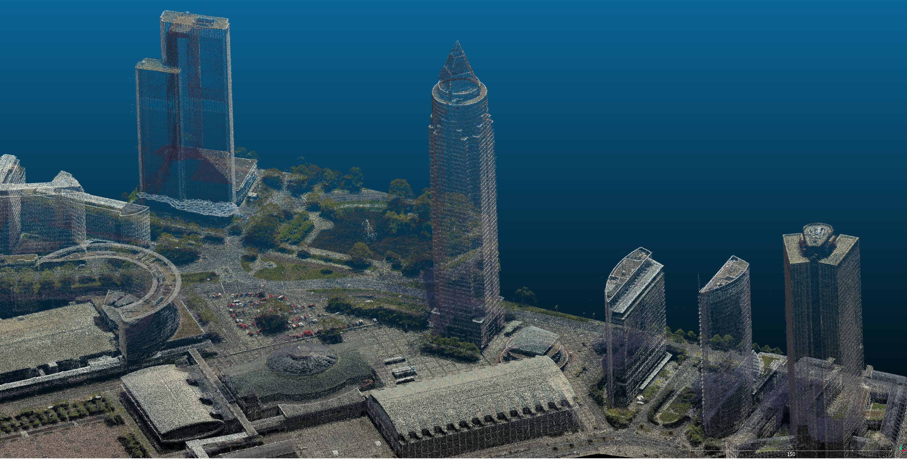
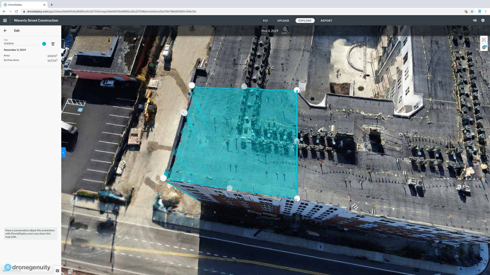
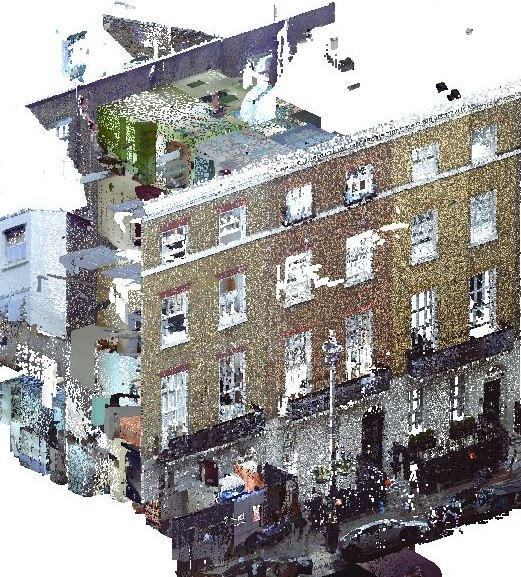
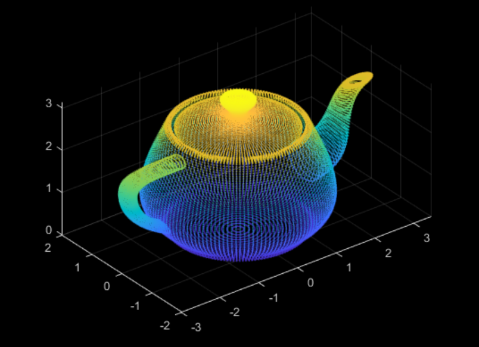
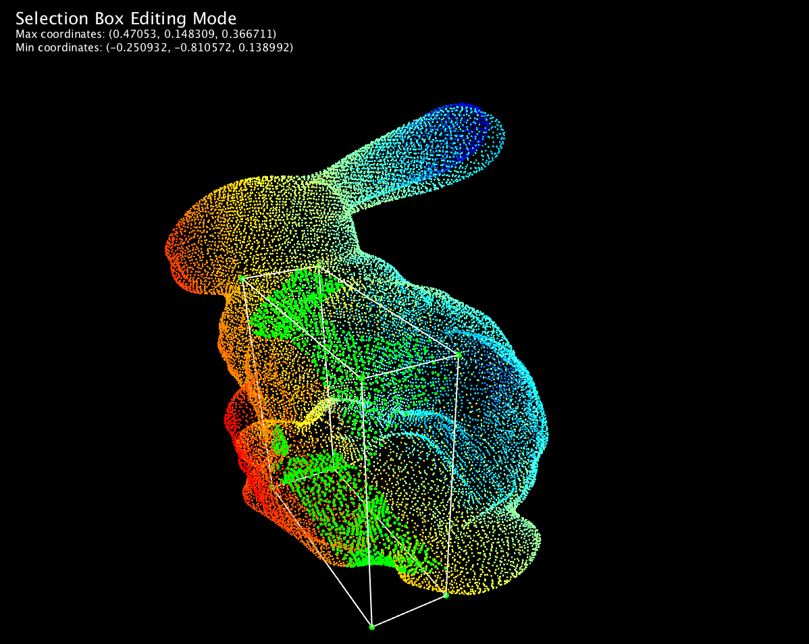
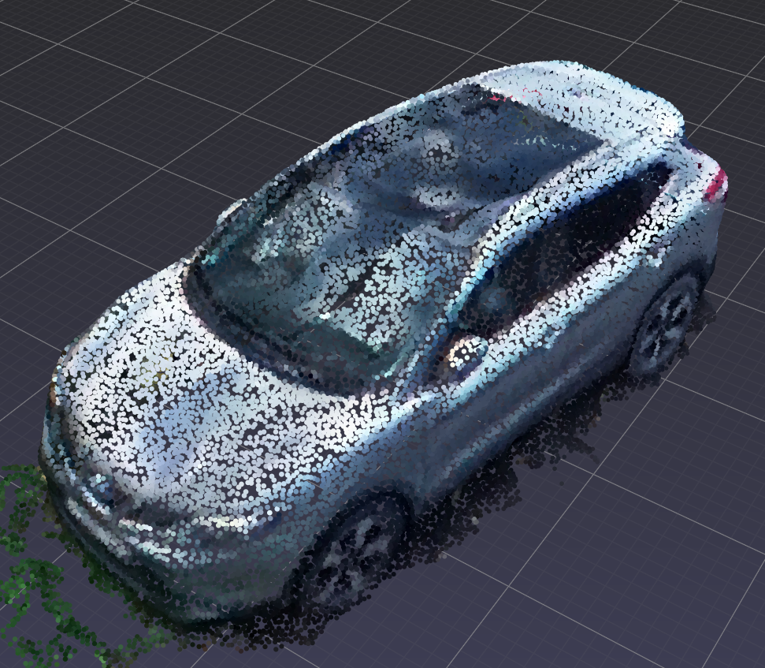

# Point Cloud

## Qu'est-ce que c'est ?

Le Point Cloud ou nuage de points en français, est une représentation à trois dimensions (tridimensionnelle, x, y ,z) d'un objet ou d'un environnement sous la forme d'un ensemble de points dans un espace 3D. Chaque point représente une coordonnée spatiale dans cet espace, et ces points peuvent également contenir des informations sur la couleur, l'intensité lumineuse, ou d'autres attributs. Il suffit de prendre un environnement en photo ou en vidéo et de l'exporter dans un logiciel qui scannera chacune des images afin d'en tirer ses formes les plus simples à l'aide de points. Le processus peut être accompli par scan laser ou par photogrammétrie. 

## Utilisation 

Le premier but des nuages de points est de créer des modèles 3D. Les nuages de points eux-mêmes peuvent être expérimentés comme un modèle 3D précisément si les points comportent les données de couleurs et de lumières, mais souvent les données de nuages sont en premier converties en polygone maillé (Mesh polygon). La plupart des programmes logiciels de modèles 3D fonctionnent avec des polygones.

### Scan laser

Le scan laser fonctionne en envoyant des pulsations de faisceaux lumineux à la surface d'un objet et mesure le temps que chaque pulsation prendra pour se refléter en retour sur le numériseur. Ces mesures sont utilisées pour déterminer la position exacte des points sur l'objet et ces mêmes points créent les nuages de points.

En l'industrie de l'architecture, les modèles 3D sont créés avec la méthode laser qui aide à produire des dessins et des modèles qui capturent les conditions actuelles et la disposition des bâtiments. La précision des modèles 3D permet de mesurer une distance, une zone ou un volume qui peut s'avérer très bénéfique pour la construction ou des projets de restauration.

### Photogrammétrie

De l'autre côté, la photogrammétrie est un processus de créations de mesures à partir d'image. Il utilise des photos d'un objet prises à différents angles afin de trianguler des points sur l'objet et place ces points dans un espace 3D. Il est possible d'utiliser n'importe quelle caméra pour ce processus à la fin sera en nuage de points tout comme le scan laser. 

En l'industrie de fabrication, des pièces et des composants peuvent être convertis en modèles 3D, ainsi exporter en CAD (computer aided design ou en français, conception assistée par ordinateur ou CAO) afin de pouvoir retouché ou modifié l'apparence de l'objet.

### Mon inspiration

Mon inspiration est de pouvoir utilisé la technologie de la numérisation laser afin de recréer un environnement en temps réel et le projecteur sur une surface. Le logiciel *GeoSLAM Connect* a pour fonction de performer le processus de point de nuage en temps réel et par la suite utiliser le programme MadMapping afin de capturer les rendus 3D et le projeté sur un mur ou dans un nuage de fumée. 

[Point clouds morphing](https://www.youtube.com/watch?v=KmdSFClL5-Q)
[GeoSLAM](https://geoslam.com/)
