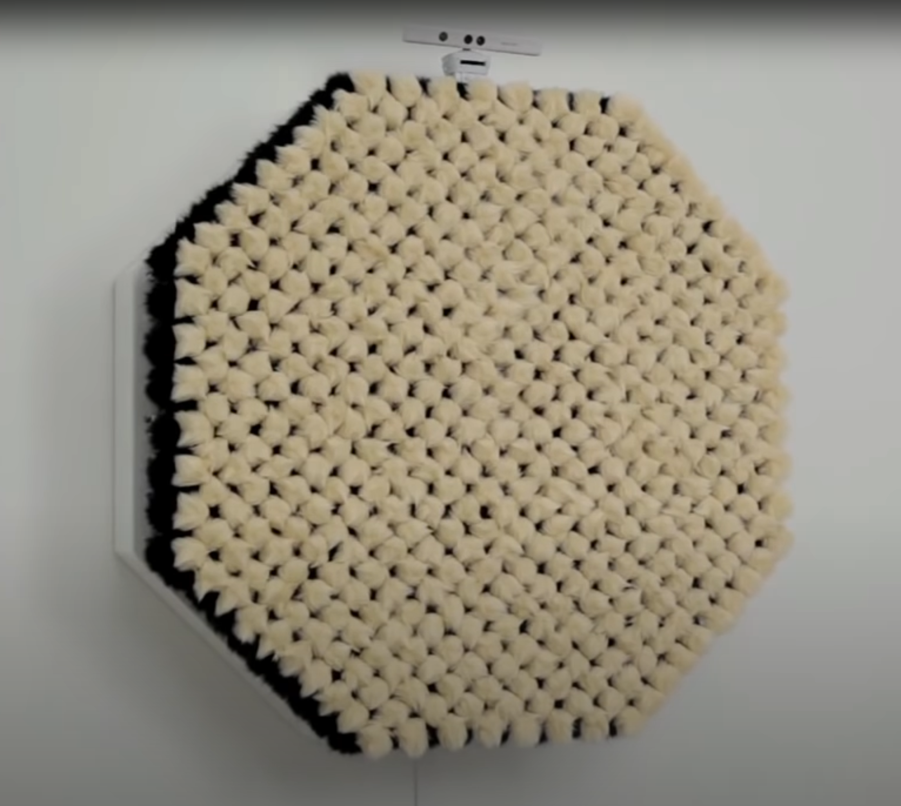
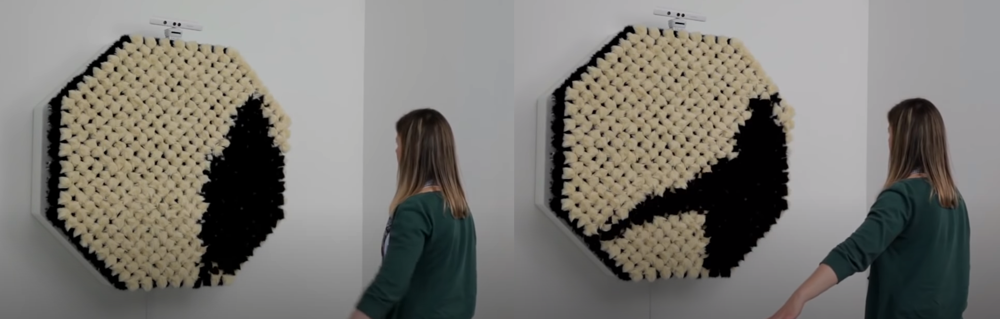
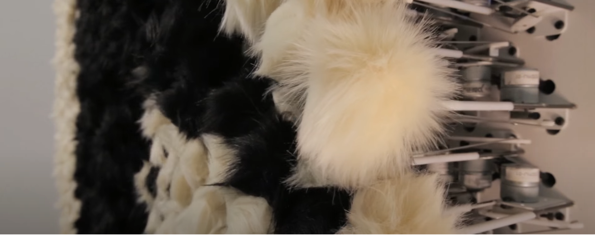

# Présentation d'un concept

## PomPom Mirror

PomPom Mirror est un cadre muni d'une Xbox Kinect qui détecte la présence d'une personne et déplace les pompons à l'aide de moteurs dissimulés en arrière afin de recrée la silhouette de la personne. Par défaut, les moteurs poussent les pompons blancs vers l'avant et les pompons noirs vers l'arrière lorsqu'il n'y a pas de mouvement dans cette zone et l'inverse lorsqu'un mouvement est détecté à cet endroit précis.

### Matériel utilisé:

- 928 pompons
- 464 moteurs
- Commande électronique
- Capteur de mouvement (Xbox Kinect)
- Ordinateur
- Armature en bois

### Aucune présence :

### Interaction :

### Mécanisme : 

[Source web](https://bitforms.art/exhibition/daniel-rozin-descent-with-modification/dr_pompom_1_w/)

[Source vidéo(Youtube)](https://www.youtube.com/watch?v=VLw3u8JRB2M&ab_channel=Insider)

### Mon inspiration

Ce concept m'inspire beaucoup, mais pour des raisons de matériels coûteux, j'envisagerais l'utilisation de lumière afin de remplacer les pompons et les moteurs. Le contrôle se fera à l'aide de la technologie Arduino, contrairement à leur logiciel personnalisé.
